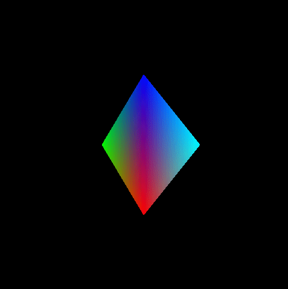
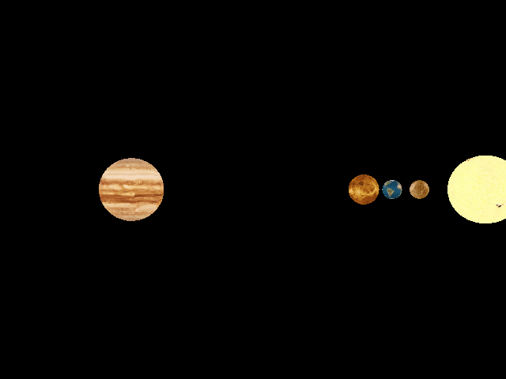
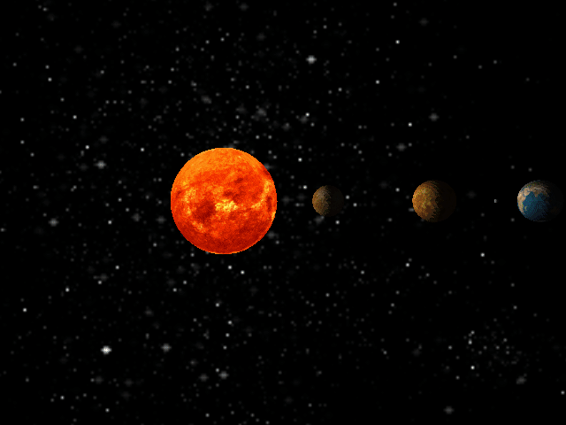
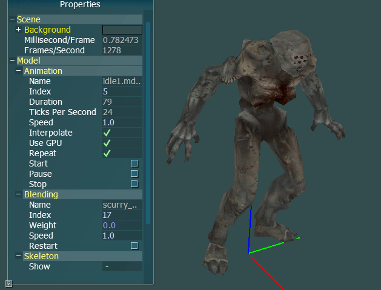
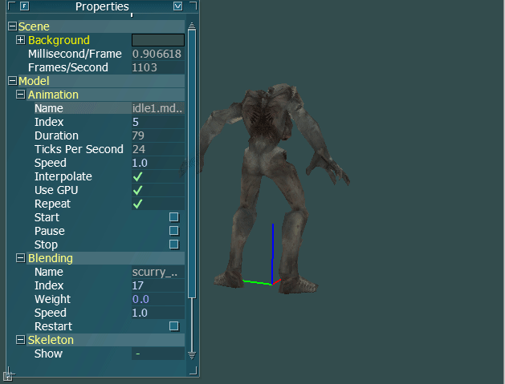

# Computer Graphics SoSe16

## Requirements

- CMake 3.12
- freeglut3-dev, freeglut3
- libsoil-dev, libsoil1
- libglew-dev, libglew1.13
- libglfw3-dev, libglfw3
- libassimp3, libassimp-dev, assimp-utils

## Classical OpenGL (P1)

- Change the background from white to black
- Rotate the triangle around the z-axis
- Enable rendering front and back faces
- Use triangles instead of a square
- Color each vertex in an different color and create a color gradient
- Change the perspective projection to an orthographic projection

## Introduction to Qt (P2)

- Create a Qt Widgets Application
- Add a QLabel, QSpinBox, QSlider and setup the layout properly
- Create a QGLWidget
- Add all functionality from project 1
- Use the Signal and Slot technique to connect the QSlider with the QSpinBox
- Create a custom Slot to change the rotation/zoom of the square
- Change the square to a cube.

## Modern OpenGL (P3)

- Replace the immediate mode with Vertex Buffer Object (VBO) to render the cube
- Create a simple Vertex- and Fragment-Shader
- Replace the functions `glPushMatrix` and `glPopMatrix` with an STL stack of `QMatrix4x4`.
- Load a model from an Wavefront-File (.obj) and render it on the screen.
- Load a texture and map it to the loaded model.
- Model the solar system with all the planets and also the moons of earth and mars. All planets and moons must have the right rotation and speed.
- Implement a camera system so that you can navigate with the keyboard around the solar system.

## Shader (P4)

- Reuse the solar system
- Create for the sun a fragment shader that simulate a heat haze
- Create a phong shading for all planets
- Create a skybox with the space

## Graduation Project: Skeletal Animation (P5)

- Loading model data and animation with assimp
- Display the model and the animation
- Compute the model transformation on CPU or GPU
- Animation blending between two selectable animations
- Show the skeleton and mark the vertices that move fast (muscle movement)
- Using AntTweakBar for controlling
- Keyboard binding
  - wasd: Move forward/backward/left/right
  - Left/Right/Up/Down: Look left/right/up/down
- **Hint:** The models and animation are from Doom 3, but for copyright reasons I can not upload these here.

Single Animation:

Animation blending:

